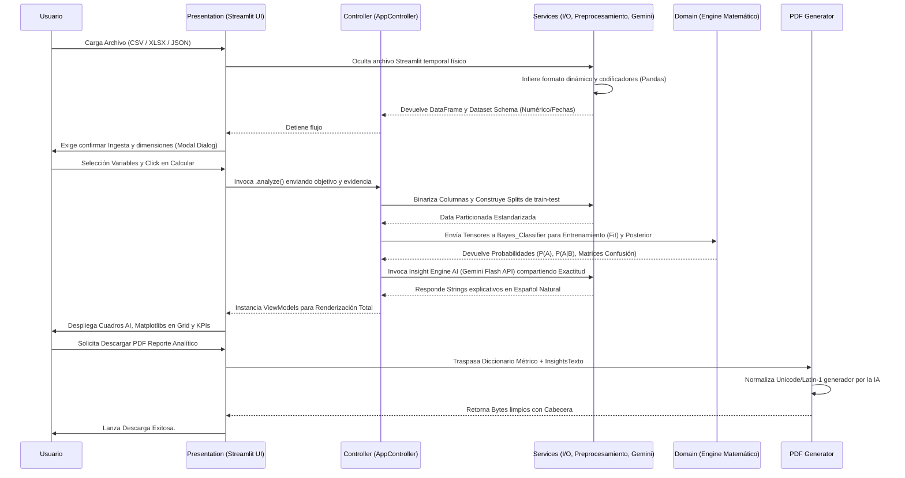

# Architecture Decision Record (ADR): Detección de Anomalías Bayesiana

## 1. Patrón de Arquitectura por Capas (Layered Architecture)
Para el desarrollo de esta plataforma de Detección de Anomalías Bayesiana, se ha seleccionado un patrón de **Arquitectura por Capas** estricto, con un claro delineamiento de las responsabilidades funcionales. Este enfoque evita el "Código Espagueti", mejora la testabilidad de los algoritmos y facilita la mantenibilidad a largo plazo.

La estructura global se divide en:
* `app/`: Contiene exclusivamente el punto de entrada de la aplicación (`main.py`) y sus configuraciones estáticas o esquemas globales (`config.py`). Actúa como el pegamento lógico que arranca el entorno.
* `domain/`: Constituye el **núcleo puro** del sistema. Aquí residen las estructuras de datos, las entidades (`models.py`), el Teorema de Bayes puro (`probability_engine.py`), el clasificador automatizado y las rúbricas de evaluación (`metrics.py`). El dominio no tiene conocimiento de la interfaz gráfica ni de cómo se persisten los datos.
* `services/`: Esta capa contiene la **Lógica de Aplicación**. Maneja la lectura de archivos I/O (`data_loader.py`), el preprocesamiento de características (`preprocessing.py`), la detección inteligente del esquema de datos, y sirve de puente para integraciones de terceros (como la IA de Gemini en `insight_engine.py` y la generación de expedientes en `pdf_generator.py`).
* `presentation/`: Dedicada plenamente a la **Interfaz de Usuario (UI)**. Consume los servicios y el dominio, organiza las visualizaciones de matplotlib (`charts/`) y gestiona todo el ciclo de retención del estado del usuario usando los paradigmas de componentes web.

## 2. Aislamiento de la Matemática y Principio "Separation of Concerns" (SoC)
El principio de **Separación de Preocupaciones** dicta que un programa de software debe dividirse en partes distintas, donde cada parte aborda una "preocupación" o necesidad separada. 

En nuestro entorno estadístico, hemos decidido aislar inflexiblemente las **matemáticas puras** (`domain/`) de la **interfaz gráfica** (`presentation/`).
**Justificaciones principales:**
1. **Preservación Científica**: El Teorema de Bayes condicional y las métricas de rendimiento (Sensibilidad, Exactitud) son leyes universales inmutables; no varían si la aplicación se ejecuta en la web o en la terminal, de modo que sus métodos no deberían contaminarse con variables del ciclo de vida web.
2. **Reutilización y Testabilidad**: Un estadista o matemático del equipo puede refactorizar y probar intensamente algoritmos bajo `domain/bayes_classifier.py` enviando *DataFrames* puros desde consola, sin tener que encender el servidor visual en absoluto.
3. **Escalabilidad del Modelo de Vista**: Los controladores, actuando como mediadores, compilan los resultados puros de dominio y los transforman en clases estáticas (como `AnalysisResultVM` o `InsightReport`), lo que blinda a la interfaz (UI) de los fallos si la lógica del modelo computacional crashea o es sustituido por un modelo neuronal más pesado a futuro. Al render gráfico solo le interesan los "strings" y los "números" procesados, no la inferencia matemática.

## 3. Elección Tecnológica Web: Streamlit para Presentation
Se decidió transicionar una UI previa codificada en `CustomTkinter` (Desktop) hacia la plataforma web **Streamlit**. Evaluamos distintas posibilidades, priorizando la entrega veloz de un entorno orientado 100% a Datos.

### Motivaciones y Mitigación de Limitaciones
Streamlit es brillante manejando el enlace de datos (Data Binding) del ecosistema Pandas a la Web de forma imperativa. No obstante, carece por diseño de atributos de front-end asíncrono tradicionales, como un nav-bar nativo, o posicionamiento en cascada tipo flexbox.
* **Header y Footer Fijos**: Para cumplir con el *Wireframe* estricto de la materia o la identidad corporativa, inyectamos CSS y HTML nativo bloqueado mediante la bandera `st.markdown(..., unsafe_allow_html=True)`. Este hack modificó asíncronamente las clases de la sombra del DOM en Streamlit (especialmente asignando un `position: fixed` sobre todo el ancho del *viewport* y empujando el área utilizable hacia el centro), otorgándole a la página una estética de Dashboard Corporativo en vez de un simple script académico, sin comprometer el renderizado reactivo del sistema subyacente de Python.
* **Componentes Reactivos Bloqueantes**: Dado que Streamlit recalcula todo el script *Top-Down* frente a cada clic (provocando demoras y cuellos de botella para operaciones matemáticas pesadas), utilizamos selectivamente elementos como *Session State* (`st.session_state`) para almacenar la data sin recrearla constantemente, y obligamos un quiebre de flujo introduciendo modales decoradores (`@st.dialog`) como una "puerta lógica" de re-ingesta, con botones de cancelación.
* **Visualizaciones Adaptativas**: Empaquetamos todo bajo un sistema moderno de grillas de 2x2 inyectando la propiedad nativa de render `st.columns`, creando "contenedores" simétricos que evalúan lado-a-lado Gráficos Numéricos *versus* Confusión y Trazos Temporales *versus* Probabilidad A Posteriori.

## 4. Flujo de Datos Global (Data Flow)
La aplicación coordina un robusto ciclo de vida, trazable desde la entrega del archivo físico por el usuario final hasta la renderización intelectual en el reporte.

